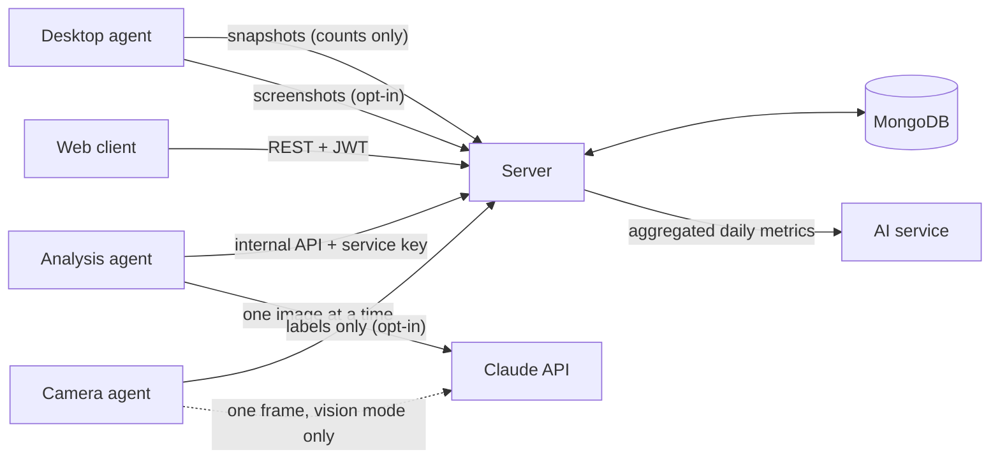

# Architecture

Six applications, each with one job:

| Component | Tech | Responsibility |
| --- | --- | --- |
| `client/` | React + Vite | Dashboards for admins, managers and employees |
| `server/` | Node.js + Express + MongoDB | Auth, access control, storage, aggregation |
| `desktop-agent/` | Electron | Collects activity counts on the employee's machine |
| `ai-service/` | Python + FastAPI | Scoring, trend and anomaly analysis, report text |
| `analysis-agent/` | Python + Claude API | Daily job: labels consented screenshots, writes a whole-day analysis (screens, camera labels, activity) |
| `camera-agent/` | Python + OpenCV (+ Claude API) | Opt-in webcam checks on the employee's machine, reported as generic labels |

## Camera checks (camera-agent)

An optional, separate opt-in. The person runs `camera-agent` on their own computer, reads what it does, and types **I AGREE** (`PUT /api/camera/consent`). While tracking is active it opens the webcam every `CAMERA_INTERVAL_MINUTES`, takes one frame and closes the camera again.

- **local mode** (default): OpenCV face detection on the device gives `present_at_desk`, `away_from_desk` or `camera_blocked`. The frame never leaves the computer.
- **vision mode** (needs vision consent): the frame goes to Claude, which returns a generic state (`working_at_computer`, `on_a_call`, `talking_with_someone`, `using_phone`, `taking_a_break`, ...) and an 8-word label with no identity, appearance, emotion or scene details.

Only `{observedAt, state, activity, confidence, source}` reaches the server. No image is ever written to disk or uploaded to WorkPlus. Labels expire after `CAMERA_RETENTION_DAYS` (TTL index). The manager and admins can see the labels (the consent text says so). Pausing tracking pauses checks, and withdrawing camera consent (or all consent) deletes every observation. The analysis agent adds camera minutes to the whole-day analysis.

## Consent and onboarding

1. **At installation**, the Windows installer and the macOS disk image show the monitoring notice in `desktop-agent/build/license_en.txt` (what is collected, that the manager and admins can view screenshots, retention). The person must click **I Agree** to install, and the app opens when installation finishes. Linux packages have no agreement screen, so there the in-app setup below is the first notice.
2. The person signs in.
3. On first launch, a three-step wizard explains what WorkPlus does, lets them choose what to share (activity time is required; keyboard counts, app names and screenshots are optional, and screenshots are off by default), and requests the matching OS permissions.
   Turning screenshots on reveals a second, required checkbox: **"I agree that my manager and administrators can view my screenshots."** Toggling screenshots off and on clears it, so it is always a fresh, explicit choice.
4. The choices are saved on the device and sent to `PUT /api/consent`. The server stores them on the `Employee` and **enforces** them: uploads of data types the person didn't allow are dropped or refused.
5. The person can change their choices or withdraw consent in the agent's Settings. Withdrawing stops tracking and deletes all of their screenshots.
6. When the terms change (consent version 1 → 2, when managers became able to view screenshots), the agent pauses tracking and asks again. The server refuses screenshots from anyone who hasn't accepted version 2 with `managerViewScreenshots: true`.

The installer agreement can't identify who agreed, so it is a notice. The in-app choices are the consent the server records and enforces.

## Starting and pausing tracking

The desktop agent records only while the employee's **tracking state** (stored on `Employee.tracking`) is `active`:

| Action | Where | New state |
| --- | --- | --- |
| Sign in | Website | `active` |
| Pause / Resume | Website top bar, or the agent's window/tray | `paused` / `active` |
| Sign out | Website | `stopped` |

The agent checks `GET /api/tracking` every 15 seconds and follows it; its own Pause/Resume is sent with `PUT /api/tracking`, so the website shows it too. The website shows whether the agent is running, based on when it last checked in. Consent is still required: an `active` state never starts trackers the person didn't agree to. While tracking is `paused` or `stopped`, the server drops activity records captured more than 90 seconds after the change (that grace keeps the record that closes the last interval) and refuses screenshots captured after it (`409`).

## Screenshot pipeline

1. With consent and OS permission, the agent captures the primary display every 5 minutes (skipped while paused, idle or locked), compresses it to a ≤1280 px JPEG, notifies the person, and uploads it (`POST /api/screenshots`). Nothing is written to the person's disk.
2. The server stores the file under `server/storage/screenshots/` (excluded from git), tagged with the consent version it was taken under.
   - The **person** can view, delete, and see who viewed each screenshot (`/api/screenshots`).
   - Their **manager** (own team only) and **admins** can list and open them (`/api/screenshots/team`). Opening an image appends `{ user, at }` to the screenshot's `views`. Screenshots taken under consent version 1 are never returned to managers.
3. Once a day, `analysis-agent` fetches pending screenshots through `/api/internal/*`, sends each to Claude, and gets back only `{category, activity, productive, confidence}`. The label must be generic: no names, messages, numbers or other text read from the screen.
4. The label is saved on the screenshot; the image stays viewable. Every screenshot, image and record, is deleted **3 days after capture** (`SCREENSHOT_RETENTION_DAYS`) by a job that runs at server start and every hour, analysed or not. The job also removes any leftover image folders older than that. Turning screenshots off or withdrawing consent deletes all of the person's screenshots immediately.
5. The agent combines the labels with the day's activity metrics, asks Claude for a short summary (text only, no images), and stores a `DailyAnalysis`.

## Data flow

1. The **desktop agent** builds a snapshot every 60 s: active/idle seconds, mouse and keyboard event *counts*, and seconds per application name. It uploads batches every 5 minutes to `POST /api/activity/snapshots` and queues them while offline.
2. The **server** stores snapshots in `activities` and `applicationusages`, then rebuilds the employee's `performances` record for each affected day (one document per employee per day).
3. Dashboards read the `performances` collection, so they never scan raw snapshots.
4. When a manager clicks **Generate report**, the server sends that employee's daily records to the **AI service**. If the AI service is down, the server writes a basic summary instead and marks it `source: "fallback"`.

## Productivity score

A transparent weighted average, computed identically in `server/src/utils/productivityCalculator.js` and `ai-service/app/models/productivity_model.py`:

| Factor | Weight |
| --- | --- |
| Active time ÷ tracked time | 0.30 |
| Productive-app time ÷ active time | 0.30 |
| Tasks completed ÷ tasks assigned | 0.25 |
| On-time tasks ÷ tasks completed | 0.15 |

Factors with no data (for example, no tasks that day) are left out and their weight is shared among the others.

## Access control

| Role | Can see | Can change |
| --- | --- | --- |
| Admin | Everyone | Employees, managers, tasks, reports |
| Manager | Employees whose `manager` is them | Tasks and reports for their team |
| Employee | Only their own data | Status of and time on their own tasks |

Scoping is enforced on the server in `middleware/roleMiddleware.js`; the client only hides what a role can't use.

## Privacy rules

1. Nothing is collected without the person's consent, and the server enforces it.
2. Store activity counts and durations, never keystroke content, window titles or URLs.
3. Tracking is visible (tray icon, status window, a notification per screenshot) and can be paused.
4. Screenshots are opt-in. The consent screen says the manager and admins can view them; every view is logged and shown to the person; the person can delete any of them; everything is deleted 3 days after capture.
5. Raw activity snapshots expire after 90 days (MongoDB TTL index); daily aggregates are kept.
6. AI output is generated from aggregated data or one-off image labels, and is always labelled as AI-generated.
