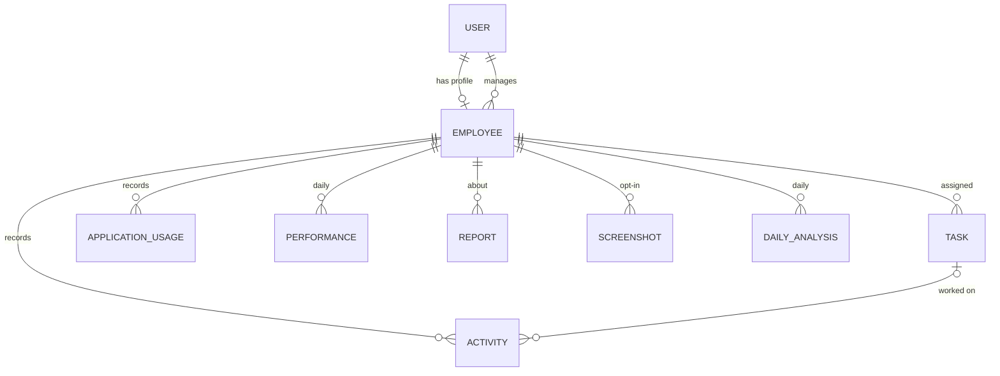

# Database

MongoDB, accessed through Mongoose models in `server/src/models/`.

| Collection | Model | Key fields | Notes |
| --- | --- | --- | --- |
| `users` | `User` | name, email, passwordHash, role, isActive | `passwordHash` is excluded from queries by default |
| `employees` | `Employee` | user, employeeCode, designation, department, manager, status, trackingConsent, consent { version, activity, keyboard, apps, screenshots, managerViewScreenshots, acceptedAt, withdrawnAt } | `manager` drives access scoping. `consent` is set only by the person, from the desktop agent. `tracking { state, changedAt, changedBy }` is the start/pause state shared by the website and the agent; `agentLastSeenAt` is when the agent last checked in |
| `tasks` | `Task` | title, assignedTo, createdBy, status, priority, expectedMinutes, actualMinutes, dueDate, completedAt | `completedAt` is set automatically when status becomes `done` |
| `activities` | `Activity` | employee, capturedAt, intervalSeconds, activeSeconds, idleSeconds, mouseEvents, keyboardEvents, task | Expires after 90 days |
| `applicationusages` | `ApplicationUsage` | employee, application, category, durationSeconds, capturedAt | App name only. Expires after 90 days |
| `performances` | `Performance` | employee, date, activeSeconds, idleSeconds, productiveAppSeconds, tasksAssigned, tasksCompleted, onTimeTasks, productivityScore | Unique per employee per day |
| `screenshots` | `Screenshot` | employee, capturedAt, bytes, filePath, consentVersion, status, analysis { category, activity, productive, confidence }, views [{ user, at }] | Managers see only `consentVersion` ≥ 2. Every manager/admin view is appended to `views`. Image and record deleted 3 days after capture (`SCREENSHOT_RETENTION_DAYS`) |
| `dailyanalyses` | `DailyAnalysis` | employee, date, screenshotCount, analyzedCount, categoryMinutes, productiveMinutes, timeline, summary, highlights, suggestions, model | Written by analysis-agent. Unique per employee per day |
| `reports` | `Report` | employee, generatedBy, periodStart, periodEnd, score, trend, summary, highlights, recommendations, anomalies, source | `source` is `ai-service` or `fallback` |

Load demo data with `npm run seed` (this **deletes** existing data first).
